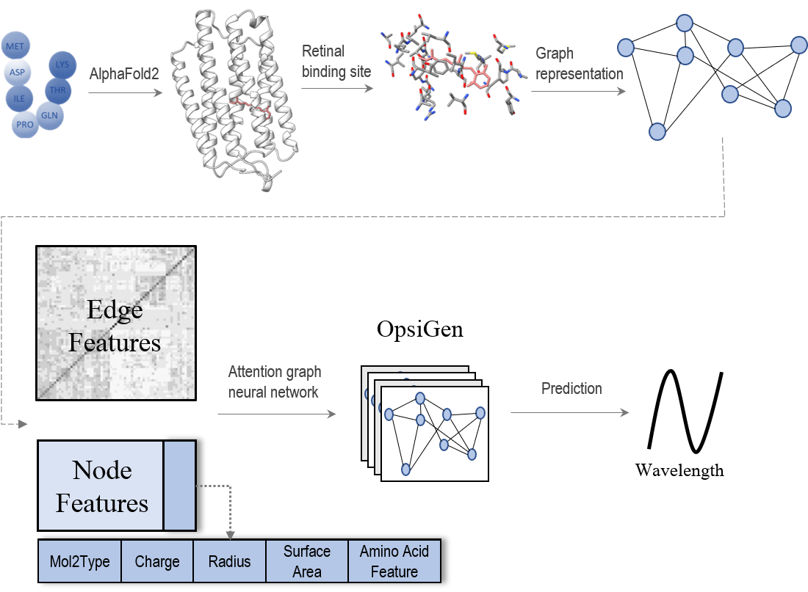

# RhoMax

RhoMax that utilizes **geometric deep learning** to predict the absorption wavelength of rhodopsins solely based on their sequences.

# How to run RhoMax locally:
1. Clone the git repository : git clone https://github.cs.huji.ac.il/dina-lab/cryo-folding/tree/colab
2. install the requirements using "pip install -r requirements.txt"
3. insert the fasta file to the folder `pipeline_auto` under the name "sample_fasta.fasta"
4. insert the pdb file to the folder `pipeline_auto` under the name "sample_pdb.pdb"
5. `cd ./pipeline_auto; ./run.sh`
6. `cd ./predict; ./run.sh`

